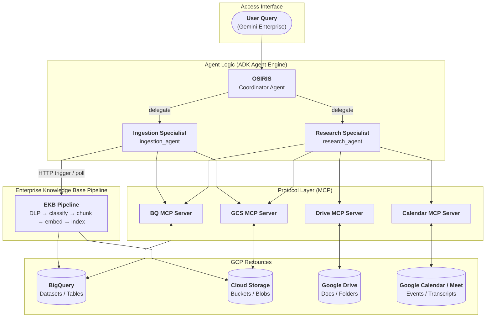

# System OSIRIS: Organizational Search, Information Retrieval, and Intelligence System

A multi-agent system designed to break information silos within your organization by searching through different sources like BigQuery, GCS, Google Drive, and Google Calendar, integrated in Gemini Enterprise.

This repository is planned to be an accelerator for implementing Gemini Enterprise in any company; allowing to integrate AI Agents capable of reading/writing data from multiple sources (based on user's permissions), such as:

- Google Drive
- Google Cloud Storage
- BigQuery
- Google Calendar

leveraging full AI Agent's capabilities to solve different use cases within a company.

## System Architecture

This project is divided into three main systems:

- Data Pipelines
- MCP Servers
- OSIRIS (AI Agents)

### Data Pipelines

Data is always in very different formats and sources, this system allows to process it and make it available to the AI Agents based on the different types of authorization.

### MCP Servers

This are the way AI Agents can access the data processed by the Data Pipelines. Due to some Gemini Enterprise pre-built connectors has limited capabilities (read-only tools), it was decided to implement custom MCP Servers for the different data sources, allowing to create, read, and update data (based on user's permissions).

### AI Agents

AI Agents are the core of the system, allowing to address different use cases within a company taking advantage of Gemini Enterprise and the custom MCP servers. So that people within the company can not only interact with the data in a more natural and efficient way, but also automate tasks and processes.

### High-Level Architecture



### Multi-Agent Architecture

Detailed view of each agent's skills, native tools, and connectors.

| Agent | Native Tools | Callbacks | MCP Servers | Skills | Description |
|---|---|---|---|---|---|
| **OSIRIS** (Coordinator) | `get_artifact_uri` · `load_artifacts` | `sync_ingestion_status` (before) | — | — | Primary user-facing interface. Analyzes every request and routes it to the appropriate specialist via LLM-transfer delegation. On each turn, proactively polls pending EKB ingestion jobs and injects status updates into session history before responding. |
| **Research Specialist** `research_agent` | `get_artifact_uri` · `import_gcs_to_artifact` · `get_current_time` · `load_artifacts` | — | BigQuery · Google Drive · Google Calendar · GCS | `meeting-summary` · `knowledge-discovery` | Searches for documents, generates meeting summaries, queries the Enterprise Knowledge Base, and cross-references information across all connected data sources. Saves its final response to session state (`research_context`) so follow-up questions can build on prior results. |
| **Ingestion Specialist** `ingestion_agent` | `get_artifact_uri` · `import_gcs_to_artifact` · `trigger_ekb_pipeline` · `check_ingestion_status` · `load_artifacts` | — | BigQuery · GCS | `kb-file-ingestion` | Orchestrates the full document ingestion lifecycle into the Enterprise Knowledge Base: guides the user through metadata collection, copies the file to the landing GCS bucket, triggers the EKB classification and indexing pipeline, and stores the returned job ID in session state for status tracking. |

## Project Structure

```text
Research-Agent/
├── agent/                      # ADK Agent implementation
│   ├── core_agent/            # Agent package (entry point + internal modules)
│   │   ├── agent.py           # Application entry point (wires config → builders → agents → app)
│   │   ├── config/            # Pydantic Settings (centralized env var validation)
│   │   ├── builder/           # Builder pattern (AgentBuilder, MCPToolsetBuilder, skills)
│   │   ├── artifact_management/ # GCS persistence and IAM security (StorageService)
│   │   ├── tools/             # Native tools: artifact, EKB pipeline, time
│   │   ├── callbacks/         # Lifecycle hooks: artifact rendering, ingestion status sync
│   │   ├── plugins/           # Message interceptors: GE file ingestion plugin
│   │   └── security/          # Token utilities (ID tokens, delegated OAuth)
│   ├── skills/                # ADK Skills
│   │   ├── meeting-summary/   # Generates structured meeting summary documents
│   │   ├── knowledge-discovery/ # High-fidelity cross-source data retrieval protocol
│   │   └── kb-file-ingestion/ # Enterprise Knowledge Base document ingestion
│   ├── deployment/            # Vertex AI / Agent Engine deployment scripts
│   └── tests/                 # Agent unit and integration tests
├── mcp_servers/               # MCP server implementations
│   ├── big_query/             # BigQuery MCP server
│   ├── gcs/                   # Cloud Storage MCP server
│   ├── google_drive/          # Google Drive MCP server
│   └── google_calendar/       # Google Calendar & Meet MCP server
├── pipelines/                 # Data ingestion pipelines
│   └── enterprise_knowledge_base/ # EKB: DLP scan → classify → chunk → embed → index
├── terraform/                 # Infrastructure as Code (Cloud Foundation Fabric modules)
│   ├── ai_agent_resources/            # Service accounts, IAM, and APIs for the agent
│   ├── bq_mcp_server_resources/       # BigQuery MCP server infrastructure
│   ├── gcs_mcp_server_resources/      # GCS MCP server infrastructure
│   ├── drive_mcp_server_resources/    # Google Drive MCP server infrastructure
│   ├── google_calendar_mcp_server_resources/ # Calendar MCP server infrastructure
│   ├── ekb_pipeline_resources/        # EKB pipeline Cloud Run and supporting resources
│   ├── base_modules/                  # Shared reusable Terraform modules
│   ├── shared_resources/              # Shared state bucket and Artifact Registry
│   └── scripts/                       # Bootstrap and CI/CD trigger scripts
├── docs/                      # Detailed documentation
├── notebooks/                 # Exploration and research notebooks
├── Makefile                   # Development automation commands
├── pyproject.toml             # Python project configuration (uv)
```

## Getting Started

### Developing with Dev Containers

We recommend using **VS Code Dev Containers** for an optimal development experience.

*   **Consistency**: Ensures everyone uses the exact same toolset and OS versions.
*   **Zero Setup**: All dependencies (uv, gcloud, terraform, docker) come pre-installed.
*   **Isolation**: Keep your local machine clean; everything runs inside a Docker container.

To use Dev Containers, the only requirements are to have **Docker** installed and the **Dev Containers extension** (available for both **VS Code** and **Antigravity**).

To start, simply open this project and click **"Reopen in Container"** when prompted.

---

### Prerequisites (If not using Dev Containers)

Ensure you have the following tools installed:

- **uv**: Python package and project manager.
- **make**: Task runner for development commands.
- **gcloud CLI**: For Google Cloud Platform interactions.
- **Terraform**: For infrastructure deployment and management.
- **Docker**: Required for building and testing MCP server images.

### Local Development & Testing

Use the `Makefile` commands to manage common tasks:

#### 1. Setup & Environment
```bash
# Authenticate with Google Cloud
make gcloud-auth

# Install dependencies using uv
uv sync --all-groups
```

#### 2. Running Tests
```bash
# Run the core Agent unit tests
make test-agent

# Run MCP Server integration tests
make run-bq-tests
make run-gcs-tests
make run-drive-tests
```

#### 3. Execution & Local Verification
```bash
# Start the Agent Web UI (ADK)
make run-ui-agent

# Start MCP Servers locally for direct testing
make run-bq-mcp-locally
make run-gcs-mcp-locally
make run-drive-mcp-locally
make run-calendar-mcp-locally
```

## Documentation

For more detailed information about each component, refer to the following documentation:

### Core AI Agent
- [Agent Overview](agent/core_agent/README.md): Architecture, builder pattern, configuration, and deployment.
- [Builder Module](agent/core_agent/builder/README.md): How `AgentBuilder`, `MCPToolsetBuilder`, and `get_skill_toolset` work.

### MCP Servers
- [BigQuery MCP Server](mcp_servers/big_query/README.md): BigQuery connector implementation.
- [Cloud Storage (GCS) MCP Server](mcp_servers/gcs/README.md): GCS connector implementation.
- [Google Drive MCP Server](mcp_servers/google_drive/README.md): Google Drive connector implementation.
- [Google Calendar MCP Server](mcp_servers/google_calendar/README.md): Google Calendar & Meet connector implementation.

### Security & Authentication
- [Authentication Methods](docs/Authentication/README.md): Strategies for identity propagation (DWD vs. OAuth).

### ADK Framework
- [ADK Introduction](docs/ADK/ADK-01-Intro.md): Introduction to the Agent Development Kit.
- [AI Agent Development Guide](docs/AI-Agent-Development/README.md): Step-by-step guide for building, deploying, and connecting agents.
