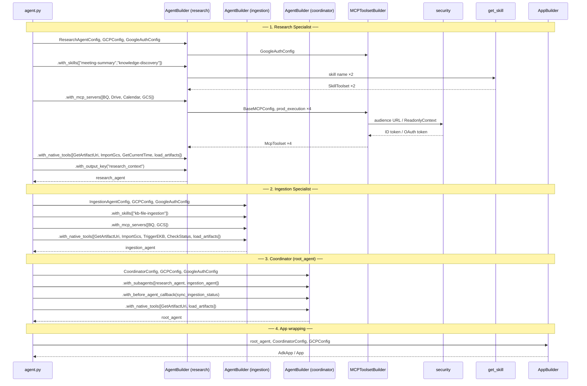
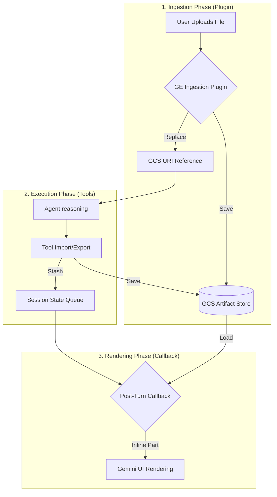

# Core ADK Agent

This package contains the ADK agent that is deployed to Vertex AI Agent Engine and surfaced through Gemini Enterprise.

The agent is an [**LLM Agent**](../../docs/ADK/ADK-01-Intro.md#llm-agents-llmagent-agent) type that integrates multiple Google data sources using **Model Context Protocol (MCP)** servers.

## Package Architecture

```
core_agent/
├── __init__.py          # Package entry point, exports the agent module
├── agent.py             # Application entry point, wires config → builders → agents → app
├── .env                 # Environment variables (Vertex AI, MCP URLs, OAuth)
│
├── config/              # Centralized Pydantic Settings (classes + singletons)
│   ├── __init__.py      # Re-exports classes and UPPER_CASE singleton instances
│   ├── agent_settings.py    # GCPConfig, BaseAgentConfig, CoordinatorConfig,
│   │                        # ResearchAgentConfig, IngestionAgentConfig, GoogleAuthConfig
│   └── mcp_settings.py     # BaseMCPConfig + per-service subclasses
│
├── builder/             # Builder pattern for agent and app construction
│   ├── __init__.py      # Re-exports AgentBuilder, AppBuilder, MCPToolsetBuilder
│   ├── agent_builder.py     # Fluent AgentBuilder orchestrator
│   ├── app_builder.py       # Orchestrates AdkApp vs. standard App construction
│   ├── mcp_factory.py       # MCPToolsetBuilder (auth + connection setup)
│   └── skills_factory.py    # get_skill (ADK Skill loader)
│
├── artifact_management/ # Infrastructure: GCS persistence and IAM security
│   ├── __init__.py      
│   ├── schemas.py       # Shared Request/Response models and state keys
│   └── service.py       # StorageService (Reference-based GCS storage)
│
├── tools/               # Agent Capabilities: Standalone tool definitions
│   ├── __init__.py      
│   ├── artifact_tools.py    # GetArtifactUriTool, ImportGcsToArtifactTool
│   ├── kb_schemas.py        # Pydantic schemas for EKB pipeline tools
│   ├── kb_tools.py          # TriggerEKBPipelineTool, CheckIngestionStatusTool
│   └── time_tools.py        # GetCurrentTimeTool (Central Time)
│
├── callbacks/           # Lifecycle Hooks: Post-turn renderers and interceptors
│   ├── __init__.py      
│   ├── artifact_rendering.py    # after_agent_callback: renders queued artifacts
│   └── ingestion_status.py     # before_agent_callback: polls EKB jobs, injects updates
│
├── plugins/             # Integrated Behaviors: Message interceptors
│   ├── __init__.py      
│   └── ingestion/       # Gemini Enterprise file ingestion orchestrator
│
└── security/            # Authentication utilities
    ├── __init__.py      # Re-exports get_id_token, get_ge_oauth_token
    └── auth.py          # GCP ID tokens + Gemini Enterprise OAuth delegation
```

## Module Overview

The package is organized into dedicated domains, each with a single responsibility:

- **`config/`** — Centralized configuration management. Contains Pydantic `BaseSettings` classes that validate environment variables at import time: `GCPConfig` (project/region/bucket), `BaseAgentConfig` (model, generation, retry settings), and three per-agent subclasses — `CoordinatorConfig`, `ResearchAgentConfig`, and `IngestionAgentConfig` — each carrying the agent's name, description, and system prompt. Exposes both the **classes** (for type hints and testing) and **singleton instances** (for runtime usage), so consumers never need to call `os.getenv()` directly.

- **`artifact_management/`** — The infrastructure layer. Contains the `StorageService`, which handles low-level GCS operations, MIME type resolution, and identity-aware IAM binding conditions. It is optimized for Gemini Enterprise by using `file_data` URI references instead of binary payloads.

- **`builder/`** — Construction logic. Separates the _what to build_ from the _how to build it_ using the Builder pattern. The `AgentBuilder` orchestrates the core agent assembly, while the `AppBuilder` handles the final application wrapper (`AdkApp` for production or `App` for local), ensuring consistent plugin and storage configuration.

- **`tools/`** — Standalone capabilities. Explicitly registered with the agent to provide specific functionality (e.g., GCS URI retrieval).

- **`callbacks/`** — Lifecycle hooks. Contains post-turn renderers that resolve and render artifacts for the Gemini Enterprise UI.

- **`plugins/`** — Integrated behaviors. Contains message interceptors like the `GeminiEnterpriseFileIngestionPlugin` that manage user-uploaded artifacts before the agent processes the message.

- **`security/`** — Token generation utilities. Provides functions to obtain GCP identity tokens (for Cloud Run service authentication) and Gemini Enterprise OAuth tokens (for delegated user data access). These are consumed by the builders at runtime, not at construction time.

The entry point `agent.py` wires everything together: it imports singletons from `config/`, assembles the agent via `AgentBuilder`, and passes it to `AppBuilder` to create the final `app` instance.

## How the Components Interact

The following sequence diagram shows the data flow between components during agent construction. **Solid arrows** (`→`) represent inputs passed to a component, and **dashed arrows** (`⇢`) represent the values returned back.



### Reading the Diagram

1. **Research Specialist** — Built first. Receives `ResearchAgentConfig`, loads two skills (`meeting-summary`, `knowledge-discovery`), mounts all four MCP servers (BigQuery, Drive, Calendar, GCS), and registers native tools including `GetCurrentTimeTool` for time-anchored calendar queries. Its final text response is persisted to session state under `"research_context"` via `output_key`.

2. **Ingestion Specialist** — Built second. Receives `IngestionAgentConfig`, loads the `kb-file-ingestion` skill, mounts BigQuery and GCS MCP servers, and registers the EKB pipeline tools (`TriggerEKBPipelineTool`, `CheckIngestionStatusTool`). The `build(enable_artifact_rendering=True)` call registers `render_pending_artifacts` as its `after_agent_callback`.

3. **Coordinator** — Built last from `CoordinatorConfig`. Receives the two already-constructed specialists as `sub_agents` for LLM-transfer delegation. The `sync_ingestion_status` function is registered as a `before_agent_callback`, so it polls pending EKB jobs and injects status updates into session history before every turn.

4. **Application wrapping** — `AppBuilder.build()` wraps `root_agent` in an `AdkApp` (production) or `App` (local), pre-configured with the `GeminiEnterpriseFileIngestionPlugin` and `StorageService` artifact backend.

## Benefits of This Architecture

| Benefit | Description |
|---|---|
| **Separation of Concerns** | Configuration, building, security, and orchestration live in dedicated modules with clear single responsibilities |
| **Fluent API** | The builder pattern (`with_skills().with_mcp_servers().build()`) makes the construction flow readable and self-documenting |
| **Centralized Configuration** | All env vars are validated once through Pydantic, eliminating scattered `os.getenv()` calls and catching misconfigurations early |
| **Dual-Export Pattern** | The `config/` module exposes both **classes** (for type hints and testing) and **singletons** (for runtime), reducing boilerplate |
| **Environment Agnostic** | The `MCPToolsetBuilder` transparently handles local OAuth (ADK-managed) vs. production OAuth (Gemini Enterprise-managed) without leaking environment logic into the agent |
| **Testability** | Each builder can be unit-tested in isolation by injecting mock configs. The clear interfaces make mocking straightforward |
| **Extensibility** | Adding a new MCP server or skill requires only a new config class + adding it to the mount list in `agent.py` |

## Drawbacks and Trade-offs

| Drawback | Description |
|---|---|
| **Indirection** | The layered architecture (config → builder → factory → agent) adds navigation overhead when debugging end-to-end flows |
| **Singleton Coupling** | Module-level singletons (`GCP_CONFIG`, etc.) are instantiated at import time, which can conflict with test fixtures that need isolated environments |
| **Builder Complexity** | For a single-agent system, the full builder + factory pattern may feel over-engineered compared to a flat script. The value scales with the number of tools/configs |
| **Private API Dependency** | Some tests rely on internal attributes of ADK classes (e.g., `_skills`, `_connection_params`), which may break on library upgrades |

## Gemini Enterprise Artifact Lifecycle

As documented in **[ADK Python Issue #4273](https://github.com/google/adk-python/issues/4273)**, Gemini Enterprise requires explicit manual handling for both file ingestion (from user uploads) and visual rendering (for tool outputs).

The following diagram illustrates how the Research-Agent orchestrates this lifecycle:



1.  **Ingestion**: User uploads arrive as inline binary data. The `GeminiEnterpriseFileIngestionPlugin` persists them to GCS and replaces them with a `file_data` reference to save tokens and avoid redundant storage.
2.  **Execution**: Tools perform their logic and save results to GCS. Because tools must return simple types (`str`/`dict`), they "stash" the filename in the session state.
3.  **Rendering**: The `render_pending_artifacts` callback (registered as an `after_agent_callback`) loads the stashed artifacts from GCS and returns them as inline `types.Part` objects, which is the only format Gemini Enterprise can render visually.

## Integrated Tools

The agent connects to backend services via **MCP servers** and exposes **ADK Skills**:

### MCP Servers
- **BigQuery**: Analytical queries against structured tables
- **Google Drive**: Read, list, and upload files
- **Google Calendar**: Upcoming events, schedule data, and Meet links
- **Google Cloud Storage (GCS)**: Search and read unstructured files from buckets

### ADK Skills
- **meeting-summary** (Research Specialist): Generates structured meeting summary documents from transcripts or notes and saves them to Drive.
- **knowledge-discovery** (Research Specialist): Expert protocol for high-fidelity retrieval across EKB, BigQuery, Drive, Calendar, and GCS using contextual anchoring and parallel discovery.
- **kb-file-ingestion** (Ingestion Specialist): Orchestrates the upload, classification, metadata tagging, and pipeline triggering for documents entering the Enterprise Knowledge Base.

> **Authentication Model**: Drive, BigQuery, Calendar, and GCS share a delegated Google OAuth token so MCP servers act on behalf of the end-user. A Cloud Run ID token (`X-Serverless-Authorization`) secures the MCP Cloud Run service itself.

## Environment Setup

### Required `.env` file

Place the `.env` file directly inside `agent/core_agent/`:

```env
# ─── Vertex AI ───
GOOGLE_GENAI_USE_VERTEXAI=TRUE
GOOGLE_CLOUD_PROJECT=your-gcp-project-id
GOOGLE_CLOUD_LOCATION=us-central1
PROJECT_ID=${GOOGLE_CLOUD_PROJECT}
REGION=${GOOGLE_CLOUD_LOCATION}

# ─── Execution Mode ───
PROD_EXECUTION=False          # Set to True in production (enables GE-managed OAuth)
ARTIFACT_BUCKET=your-artifact-bucket-name

# ─── Agent Config ───
MODEL_ARMOR_TEMPLATE_ID=your-model-armor-template-id   # Omit to disable Model Armor

# ─── EKB Pipeline ───
EKB_PIPELINE_URL=https://ekb-pipeline-xxxxx-uc.a.run.app

# ─── Gemini Enterprise Delegated OAuth ───
GEMINI_GOOGLE_AUTH_ID=shared-oauth-resource-id

# ─── MCP Servers (optional, defaults to localhost) ───
BIGQUERY_URL=https://bigquery-mcp-server-xxxxx-uc.a.run.app
DRIVE_URL=https://google-drive-mcp-server-xxxxx-uc.a.run.app
CALENDAR_URL=https://calendar-mcp-server-xxxxx-uc.a.run.app
GCS_URL=https://gcs-mcp-server-xxxxx-uc.a.run.app

# ─── Local OAuth (for development only) ───
GOOGLE_OAUTH_CLIENT_ID=your-oauth-client-id.apps.googleusercontent.com
GOOGLE_OAUTH_CLIENT_SECRET=your-oauth-client-secret
GOOGLE_OAUTH_REDIRECT_URI=http://localhost:8000/dev-ui
```

## How to Test Locally

### 1. Authenticate with GCP

```bash
gcloud auth application-default login --project your-gcp-project-id
gcloud config set project your-gcp-project-id
```

Or use the Makefile shortcut:

```bash
make gcloud-auth
```

### 2. Start the Agent Dev UI

```bash
make run-ui-agent
```

This runs `uv run adk web --port 8000` inside the `agent/` directory.

### 3. Run Tests

```bash
make test-agent
```

## Deployment Pattern

In production, the agent calls backend MCP servers using up to two layers of auth:

- **MCP service auth**: A Cloud Run ID token in `X-Serverless-Authorization` to reach the protected Cloud Run endpoint.
- **Delegated user data auth**: An OAuth token in `Authorization` so the MCP server can call Google APIs on behalf of the end-user.

The delegated token originates from Gemini Enterprise authorization attached to the agent registration (`GEMINI_GOOGLE_AUTH_ID`). The code injects this per-request via `header_provider` so each call reflects the specific user session.

---

> **⚠️ ADK Naming Convention**: The ADK CLI (`adk web`) expects a specific directory and variable structure to discover and run the agent locally. The folder must be named `core_agent` (matching the package import path), and the `agent.py` file must expose a variable called `root_agent` (the `Agent` instance) and `app` (the `AdkApp` wrapper). If the directory is renamed or these variables are moved, the ADK local Dev UI (`adk web`) will fail to locate the agent.
