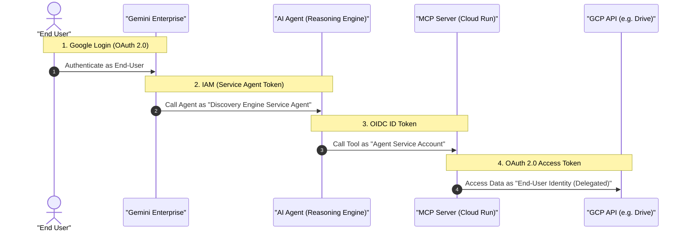

# OAuth 2.0 Integration Inside Gemini Enterprise (CLI Flow)

This document provides a streamlined, CLI-first guide for setting up OAuth 2.0 integration within Gemini Enterprise. This approach avoids circular dependencies by creating a stable Authorization Resource before deploying and registering the agent.

---

## Prerequisites

- **Discovery Engine Admin Role**: Required to manage authorizations and agents.
- **Discovery Engine API**: Must be enabled in your Google Cloud project.
- **Existing Gemini Enterprise App**: The agent must be associated with an app.

---

## Deployment & OAuth Flow

### 1. Create OAuth Credentials (GCP)
Refer to the [official documentation on creating OAuth credentials](https://docs.cloud.google.com/gemini/enterprise/docs/register-and-manage-an-adk-agent?hl=en#obtain_authorization_details) for detailed GCP console instructions.

1. Go to **APIs & Services > Credentials** in the Google Cloud Console.
2. Click **Create Credentials > OAuth client ID**.
3. Select **Web application** as the application type.
4. Add the following **Authorized redirect URIs**:
   - `https://vertexaisearch.cloud.google.com/oauth-redirect`
   - `https://vertexaisearch.cloud.google.com/static/oauth/oauth.html`
5. Download the JSON key file; you will need the `client_id`, `client_secret`, `auth_uri`, and `token_uri`.

### 2. Create an OAuth Resource (Gemini Enterprise)
Refer to the [official documentation on adding authorization resources](https://docs.cloud.google.com/gemini/enterprise/docs/register-and-manage-an-adk-agent?hl=en#add-authorization-resource) for additional API context.

Use the REST API to create a global authorization resource. This defines a stable `AUTH_ID` that the AI Agent will use.

**Build the OAUTH_AUTH_URI:**
You must construct the Authorization URI using your client ID and required scopes. 

**Scopes Example:**
- Scope 1: `https://www.googleapis.com/auth/drive.readonly`
- Scope 2: `https://www.googleapis.com/auth/documents`

**Resulting URI (Template):**
`https://accounts.google.com/o/oauth2/v2/auth?client_id=`**`[CLIENT_ID]`**`&redirect_uri=https%3A%2F%2Fvertexaisearch.cloud.google.com%2Fstatic%2Foauth%2Foauth.html&scope=https://www.googleapis.com/auth/drive.readonly%20https://www.googleapis.com/auth/documents&include_granted_scopes=true&response_type=code&access_type=offline&prompt=consent`

> [!TIP]
> Use `%20` to separate multiple scopes. This URI will be used in **Step 2** and **reused in Step 4**.

**Create the Resource:**
```bash
curl -X POST \
  -H "Authorization: Bearer $(gcloud auth print-access-token)" \
  -H "Content-Type: application/json" \
  -H "X-Goog-User-Project: [PROJECT_ID]" \
  "https://[ENDPOINT_LOCATION]-discoveryengine.googleapis.com/v1alpha/projects/[PROJECT_ID]/locations/[LOCATION]/authorizations?authorizationId=[AUTH_ID]" \
  -d '{
    "serverSideOauth2": {
      "clientId": "[OAUTH_CLIENT_ID]",
      "clientSecret": "[OAUTH_CLIENT_SECRET]",
      "authorizationUri": "[OAUTH_AUTH_URI]",
      "tokenUri": "[OAUTH_TOKEN_URI]"
    }
  }'
```

**Parameters Definitions:**
| Parameter | Description | Possible Values / Constraints | Source / Example |
| :--- | :--- | :--- | :--- |
| `[PROJECT_ID]` | Alphanumeric Google Cloud Project ID. | Alphanumeric string | `mock-gcp-project-id` |
| `[ENDPOINT_LOCATION]`| API multi-region for request. | `us`, `eu`, or `global` | `global` |
| `[LOCATION]` | Specific location for auth resources. | `us`, `eu`, or `global` | `global` |
| `[AUTH_ID]` | Custom ID for the authorization resource. | Alphanumeric, unique in project | `my-defined-auth-id` |
| `[OAUTH_CLIENT_ID]` | Client ID from the GCP JSON key. | Standard OAuth client ID format | `mock-client-id.apps.googleusercontent.com` |
| `[OAUTH_CLIENT_SECRET]`| Client Secret from the GCP JSON key. | Sensitive secret string | `mock-client-secret` |
| `[OAUTH_AUTH_URI]` | The URI constructed in Step 2. | Valid URL starting with `https` | (See example above) |
| `[OAUTH_TOKEN_URI]` | Token URI from the GCP JSON key. | Valid OAuth token URL | `https://oauth2.googleapis.com/token` |

### 3. Deploy the Agent (Agent Engine)
Deploy your agent to **Vertex AI Agent Engine** via your **CI/CD pipeline**. The agent code uses a Pydantic `BaseSettings` subclass (`MCPServersConfig`) to manage its configuration.

**CI/CD Injection Flow:**
- The configuration class includes a field (e.g., `GEMINI_DRIVE_AUTH_ID`) that stores the `AUTH_ID` created in Step 2.
- In a production flow, this value (and other secrets) is stored in **Google Cloud Secret Manager**.
- The **CI/CD pipeline** retrieves these secrets and injects them as environment variables into the Agent's runtime environment during deployment.
- If the agent uses multiple tools with different authorizations, each unique `AUTH_ID` must be injected as a separate environment variable.

> [!IMPORTANT]
> Ensure the `AUTH_ID` injected by your pipeline precisely matches the `[AUTH_ID]` used in the Step 2 CLI command.

### 4. Register the Agent (Gemini Enterprise)
Refer to the [official documentation on registering an ADK agent](https://docs.cloud.google.com/gemini/enterprise/docs/register-and-manage-an-adk-agent?hl=en#register_adk_agent-drest) for more details.

Link your deployed agent to the Gemini Enterprise application and the authorization resource using the CLI.

```bash
curl -X POST \
  -H "Authorization: Bearer $(gcloud auth print-access-token)" \
  -H "Content-Type: application/json" \
  -H "X-Goog-User-Project: [PROJECT_ID]" \
  "https://[ENDPOINT_LOCATION]-discoveryengine.googleapis.com/v1alpha/projects/[PROJECT_ID]/locations/global/collections/default_collection/engines/[APP_ID]/assistants/default_assistant/agents" \
  -d '{
    "displayName": "[DISPLAY_NAME]",
    "description": "[DESCRIPTION]",
    "icon": { "uri": "[ICON_URI]" },
    "adk_agent_definition": {
      "provisioned_reasoning_engine": {
        "reasoning_engine": "projects/[PROJECT_ID]/locations/[REASONING_ENGINE_LOCATION]/reasoningEngines/[ADK_RESOURCE_ID]"
      }
    },
    "authorization_config": {
      "tool_authorizations": [
        "projects/[PROJECT_NUMBER]/locations/global/authorizations/[AUTH_ID]"
      ]
    }
  }'
```

**Parameters Definitions:**
| Parameter | Description | Possible Values / Constraints | Source / Example |
| :--- | :--- | :--- | :--- |
| `[PROJECT_ID]` | Alphanumeric Google Cloud Project ID. | Alphanumeric string | `mock-gcp-project-id` |
| `[PROJECT_NUMBER]` | Numeric Google Cloud Project Number. | 12-digit number | `123456789012` |
| `[ENDPOINT_LOCATION]`| API multi-region for request. | `us`, `eu`, or `global` | `global` |
| `[APP_ID]` | Unique ID for your GE app. | From URL or GE Console | `mock-ge-app-id` |
| `[DISPLAY_NAME]` | Human-readable name for the agent. | Any string | `mock-agent-display-name` |
| `[DESCRIPTION]` | Brief summary of capabilities. | Any string | `mock-agent-description` |
| `[ICON_URI]` | URI for the display icon. | Valid URL or placeholder | `https://example.com/mock-icon.png` |
| `[REASONING_ENGINE_LOCATION]` | Region of agent deployment. | Any valid GCP region | `us-central1` |
| `[ADK_RESOURCE_ID]` | Numeric ID of the Agent Engine resource. | Numeric ID from deployment | `1234567890123456789` |
| `[AUTH_ID]` | The stable ID defined in Step 2. | Alphanumeric, must exist | `my-defined-auth-id` |

### 5. Add Users to the Agent
Refer to the [official documentation on adding users to an agent](https://docs.cloud.google.com/gemini/enterprise/docs/data-agent?hl=en#set-permissions) for console-specific steps.

In the Gemini Enterprise console, authorize specific users or groups to use the agent.

---

## Multiple OAuth Credentials

If your agent interacts with multiple MCP servers that require distinct OAuth client IDs, follow **Step 2** for each set of credentials. In **Step 4**, include all relevant authorization resources in the `tool_authorizations` list:

```json
"authorization_config": {
  "tool_authorizations": [
    "projects/[PROJECT_NUMBER]/locations/global/authorizations/DRIVE_AUTH",
    "projects/[PROJECT_NUMBER]/locations/global/authorizations/OTHER_AUTH"
  ]
}
```

---

## Troubleshooting & Management

### CLI vs. Console Registration
This guide recommends using the **CLI (curl)** in Step 4 because it allows you to explicitly link the agent to a specific `AUTH_ID`. 

If you choose to register the agent via the **Gemini Enterprise Console (UI)**:
1.  Gemini Enterprise will generate a **new, unique Auth ID** (e.g., `your-name_123456789`).
2.  Your agent will **fail to execute** initially because it is still pointing to the ID from Step 2.
3.  **Resolution**: You must check your **Agent Engine logs** to find the new Auth ID, update your agent's environment variables, and **redeploy the agent**.

### Why use `get_ge_oauth_token`?
When integrated with Gemini Enterprise, the OAuth flow is managed by the GE platform itself. This means:
1.  **GE handles the Handshake**: GE performs the OAuth redirect, token exchange, and refresh token storage.
2.  **Token Availability**: The resulting access token is automatically injected into the agent's context (`ctx.state`) under the `AUTH_ID` key.
3.  **Manual Injection**: Instead of defining an `auth_credential` in the tool configuration - MCPToolset (which would trigger the ADK's internal, redundant OAuth flow), it's required to use a helper like `get_ge_oauth_token` to retrieve the token from the context and inject it manually into the `Authorization` header of the tool calls.

**Implementation Example:**
```python
from google.adk.agents.readonly_context import ReadonlyContext
from google.adk.tools.mcp_tool import McpToolset
from google.adk.tools.mcp_tool.mcp_session_manager import StreamableHTTPConnectionParams

# Helper function to extract the token from Gemini Enterprise's context injection
def get_ge_oauth_token(readonly_context: ReadonlyContext, auth_id: str) -> str | None:
    return readonly_context.state.get(auth_id)

my_mcp_toolset = McpToolset(
    connection_params=StreamableHTTPConnectionParams(url="https://remote-mcp-server.run.app"),
    # Manually provide the Authorization header dynamically per-request
    header_provider=lambda ctx: {
        "Authorization": f"Bearer {get_ge_oauth_token(ctx, 'MY_AUTH_RESOURCE_ID')}"
    }
)
```

### Deleting Agent-Managed OAuth Flow (The Root Cause of Failure)
> [!IMPORTANT]
> **To prevent execution failures, you MUST remove any `auth_credential` blocks from your tool definitions when deploying to Gemini Enterprise.**

**The Architectural Mismatch:**
The standard ADK OAuth flow (configured via passing `auth_credential` to a toolset) relies on an interactive `adk_request_credential` event. As detailed in the [ADK Auth Docs](https://google.github.io/adk-docs/tools-custom/authentication/), this framework flow expects the client application to handle the browser redirect and then send an updated `FunctionResponse` containing the exchanged OAuth code back to the ADK session.

**Why it fails in production:**
1.  **Agent Engine Limitations**: Vertex AI Agent Engine hosts the agent logic, but it is not a web server. It lacks the routing capabilities to receive an OAuth callback directly.
2.  **GE Context Injection**: Instead of fulfilling the ADK's expectation of a `FunctionResponse`, Gemini Enterprise intercepts the need for authorization natively, manages the token exchange internally, and forcefully injects the resulting access token into the agent's `ctx.state`.
3.  **The Deadlock**: If you leave `auth_credential` configured, the ADK framework remains stuck waiting for its internal exchange process to complete, ignoring the token GE already injected into the context. This leads to a hanging execution or an authentication failure.

**The Solution:**
By removing `auth_credential` and instead using the `header_provider` injection with `get_ge_oauth_token()`, we bypass the ADK's internal OAuth circuit breaker entirely, allowing the agent to seamlessly utilize the token GE has already provided.

### List Authorization Resources
```bash
curl -X GET \
  -H "Authorization: Bearer $(gcloud auth print-access-token)" \
  "https://[LOCATION]-discoveryengine.googleapis.com/v1alpha/projects/[PROJECT_ID]/locations/[LOCATION]/authorizations"
```

### Delete an Authorization Resource
```bash
curl -X DELETE \
  -H "Authorization: Bearer $(gcloud auth print-access-token)" \
  "https://[LOCATION]-discoveryengine.googleapis.com/v1alpha/projects/[PROJECT_ID]/locations/[LOCATION]/authorizations/[AUTH_ID]"
```

**Troubleshooting Parameters:**
| Parameter | Description | Possible Values / Constraints | Source / Example |
| :--- | :--- | :--- | :--- |
| `[PROJECT_ID]` | Alphanumeric Google Cloud Project ID. | Alphanumeric string | `mock-gcp-project-id` |
| `[LOCATION]` | Location where the resource exists. | `us`, `eu`, or `global` | `global` |
| `[AUTH_ID]` | The ID of the resource to manage. | Alphanumeric, must exist | `my-defined-auth-id` |

> [!CAUTION]
> Deleting an authorization resource linked to an active agent will cause that agent to fail during its next OAuth flow.

---

## Authentication Summary



| Flow Layer | Authentication Method | Identity |
| :--- | :--- | :--- |
| **User -> Gemini Enterprise** | Google Login (OAuth 2.0) | End-User Identity |
| **Gemini Enterprise -> Agent** | IAM (Service Agent Token) | Discovery Engine Service Agent |
| **Agent -> MCP Server** | OIDC ID Token | Agent Service Account |
| **MCP Server -> GCP API** | OAuth 2.0 Access Token | End-User Identity (Delegated) |
