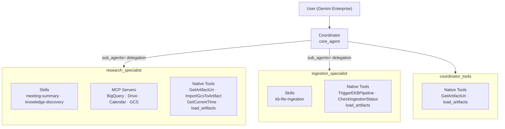
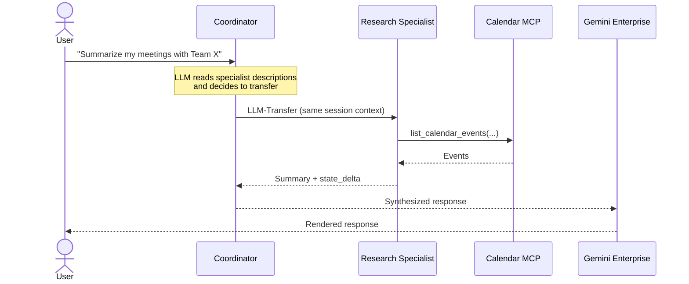
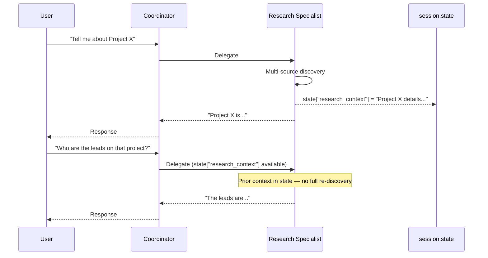
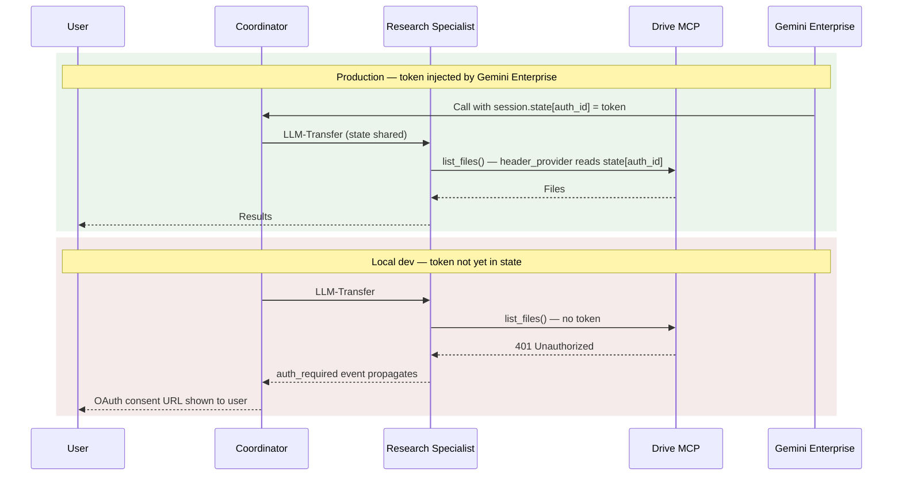

# 12 - Multi-Agent Architecture

This document describes the rationale, design, and implementation of the Research-Agent's multi-agent topology, which replaced the original monolithic single-agent design.

---

## 1. Rationale: Why Multi-Agent?

The original Research-Agent was a single `Agent` instance that owned all MCP servers, skills, and tools in one flat toolset. While functional, this design introduced scaling problems as the system grew:

| Limitation | Impact |
| :--- | :--- |
| **No task specialization** | The LLM had to reason over all available tools (Calendar, Drive, BigQuery, GCS, EKB pipeline) for every request, increasing the likelihood of misdirected tool calls. |
| **No cross-turn research memory** | Research results were not persisted to session state, so follow-up questions required full re-discovery from scratch. |
| **No separation of concerns** | EKB ingestion tools and knowledge research tools shared a single system prompt and toolset, introducing role ambiguity for the model. |
| **Single point of instruction** | Adding new skills or MCP servers made the system prompt longer and the model's routing decisions noisier. |

The multi-agent refactor introduces a **Coordinator → Specialist** topology that addresses all four limitations by giving each agent a distinct identity, toolset, and system prompt.

---

## 2. Architecture Overview

The system is composed of three agents, each built with an `AgentBuilder` and wired together via the `sub_agents=` parameter on the Coordinator.



### Agent Roles

| Agent | Config Class | Responsibility |
| :--- | :--- | :--- |
| **Coordinator** (`root_agent`) | `CoordinatorConfig` | Primary user interface. Routes requests to specialists, retrieves artifact URIs, and synthesizes final responses. Never performs deep research or ingestion directly. |
| **Research Specialist** (`research_agent`) | `ResearchAgentConfig` | Multi-source discovery across EKB, BigQuery, Drive, Calendar, and GCS. Retains research results across turns via `output_key`. |
| **Ingestion Specialist** (`ingestion_agent`) | `IngestionAgentConfig` | Triggers and monitors the EKB ingestion pipeline. |

---

## 3. Delegation Pattern: LLM-Transfer via `sub_agents=`

Specialists are registered on the Coordinator using the `sub_agents=` parameter of the ADK `Agent` class. When the Coordinator's LLM recognizes that a request matches a specialist's declared `description`, it issues a **transfer** to that specialist. No new session is created — the specialist runs within the same invocation context.



> [!IMPORTANT]
> The `sub_agents=` pattern preserves the **same invocation context**: coordinator and specialists share session state, credentials, and event channels. This is the key distinction from the `AgentTool` pattern. See [AgentTool-vs-SubAgents.md](AgentTool-vs-SubAgents.md) for a full technical comparison.

---

## 4. Why `sub_agents=` Instead of `AgentTool`

The initial implementation of this branch used `AgentTool` (explicit tool invocation) to expose specialists as callable tools, which would have enabled Gemini's native parallel function calling. However, `AgentTool` creates an **isolated session** for each specialist call, which caused three critical failures:

| Failure | Root Cause |
| :--- | :--- |
| **OAuth challenges silently dropped** | `AgentTool` runs the specialist in a new `InMemorySessionService`. OAuth `requested_auth_configs` events emitted inside the isolated session cannot escape to the user's session. |
| **`file_data` content stripped** | `AgentTool.run_async` extracts only `.text` parts from the specialist's final response. `file_data` parts (rendered artifacts) are discarded. |
| **`after_agent_callback` ineffective** | `render_pending_artifacts` fires inside the isolated session, but its `file_data` output is dropped before the coordinator sees it. State keys are cleared, so the coordinator's own callback also finds nothing. |

Reverting to `sub_agents=` resolves all three because specialists share the parent session's event channel and storage context. See [AgentTool-vs-SubAgents.md](AgentTool-vs-SubAgents.md) for the internal mechanics.

---

## 5. Cross-Turn Research Memory

The Research Specialist is configured with an `output_key`:

```python
research_agent = (
    AgentBuilder(...)
    .with_output_key("research_context")
    .build()
)
```

After every research turn, the ADK framework writes the specialist's final text response to `session.state["research_context"]`. On subsequent turns, the Coordinator passes this prior context to the specialist when delegating, enabling follow-up questions without full re-discovery.



---

## 6. OAuth Propagation in the Multi-Agent Context

With `sub_agents=` delegation, specialists run inside the same invocation context as the Coordinator. OAuth token access works correctly in both environments:



- **Production**: Gemini Enterprise injects the OAuth token into `session.state[auth_id]`. Because state is shared, `get_ge_oauth_token(ctx, auth_id)` in the MCP `header_provider` reads the token directly from the specialist's context.
- **Local development**: If no token is in state, the MCP tool emits a `requested_auth_configs` event. Because `sub_agents=` shares the event channel, the OAuth challenge **reaches the user's browser** — unlike `AgentTool`, which silently drops it.

---

## 7. Artifact Rendering in the Multi-Agent Context

`render_pending_artifacts` must fire **only on the Coordinator (root agent)**. Sub-agents must always be built with `enable_artifact_rendering=False`.

| Agent | `enable_artifact_rendering` | Rationale |
| :--- | :---: | :--- |
| Research Specialist | `False` | Sub-agents must not render. See note below. |
| Ingestion Specialist | `False` | Sub-agents must not render. Produces text-only status responses anyway. |
| Coordinator | `True` (default) | Root agent — the sole owner of the render lifecycle. |

> [!IMPORTANT]
> Setting `enable_artifact_rendering=True` on a sub-agent causes stale URIs to leak across turns, resulting in follow-up questions returning no information. The ADK sub-agent callback context does not reliably flush its state delta back to the persistent session when the callback returns a non-`None` `Content`. Clearing `PENDING_URI_KEY` inside a sub-agent callback only affects that callback's transient scope — the session-level key remains populated. On the next turn the same stale URIs are rendered again, replacing the sub-agent's actual response with raw `file_data` parts.
>
> The Coordinator's `after_agent_callback` runs at session scope; its state mutations always persist. Making the Coordinator the sole renderer guarantees `PENDING_URI_KEY` is cleared exactly once, at the right level.

Sub-agents can still read documents through their own tools — `enable_artifact_rendering=False` only removes the callback. See [13-Artifact-Rendering-Callback-Scope.md](13-Artifact-Rendering-Callback-Scope.md) for a full explanation of the state-scope issue, the fix, and what document-reading capabilities remain available inside sub-agents.

For a full description of the stash-and-render pattern, see [09-Architecture-and-Deduplication.md](09-Architecture-and-Deduplication.md).

---

## 8. The AgentBuilder Pattern

All three agents are assembled using the fluent `AgentBuilder` in `agent/core_agent/agent.py`:

```python
# Research Specialist — sub-agent: never renders artifacts
research_agent = (
    AgentBuilder(agent_config=RESEARCH_AGENT_CONFIG, gcp_config=GCP_CONFIG, auth_config=GOOGLE_AUTH_CONFIG)
    .with_skills(["meeting-summary", "knowledge-discovery"])
    .with_mcp_servers([BIGQUERY_MCP_CONFIG, DRIVE_MCP_CONFIG, CALENDAR_MCP_CONFIG, GCS_MCP_CONFIG])
    .with_native_tools([GetArtifactUriTool(), ImportGcsToArtifactTool(), GetCurrentTimeTool(), load_artifacts])
    .with_output_key("research_context")
    .build(enable_artifact_rendering=False)
)

# Ingestion Specialist — sub-agent: never renders artifacts
ingestion_agent = (
    AgentBuilder(agent_config=INGESTION_AGENT_CONFIG, gcp_config=GCP_CONFIG, auth_config=GOOGLE_AUTH_CONFIG)
    .with_skills(["kb-file-ingestion"])
    .with_native_tools([TriggerEKBPipelineTool(), CheckIngestionStatusTool(), load_artifacts])
    .build(enable_artifact_rendering=False)
)

# Coordinator (Root Agent)
root_agent = (
    AgentBuilder(agent_config=COORDINATOR_CONFIG, gcp_config=GCP_CONFIG, auth_config=GOOGLE_AUTH_CONFIG)
    .with_subagents([research_agent, ingestion_agent])
    .with_before_agent_callback(sync_ingestion_status)
    .with_native_tools([GetArtifactUriTool(), load_artifacts])
    .build()
)
```

### Builder Method Reference

| Method | Description |
| :--- | :--- |
| `with_skills(names)` | Loads ADK `SkillToolset` entries from `agent/skills/`. |
| `with_mcp_servers(configs)` | Creates an `McpToolset` for each MCP server config via `MCPToolsetBuilder`. |
| `with_native_tools(tools)` | Registers `BaseTool` instances or plain callables (auto-wrapped in `FunctionTool`). |
| `with_subagents(agents)` | Registers specialist agents via `sub_agents=` LLM-transfer delegation. |
| `with_output_key(key)` | Persists the agent's final text to `session.state[key]` for cross-turn memory. |
| `with_before_agent_callback(fn)` | Sets the `before_agent_callback` (e.g., `sync_ingestion_status`). |
| `build(enable_artifact_rendering)` | Assembles the `Agent`. Always `False` for sub-agents; only the root Coordinator uses the default `True`. |

---

## 9. Configuration Design

Each agent has its own Pydantic `BaseSettings` subclass carrying its name, system prompt, and capability description:

```
BaseAgentConfig
├── CoordinatorConfig       # AGENT_NAME = "core_agent"
├── ResearchAgentConfig     # AGENT_NAME = "research_specialist"
│                           # AGENT_DESCRIPTION = "Retrieves and synthesizes..."
└── IngestionAgentConfig    # AGENT_NAME = "ingestion_specialist"
                            # AGENT_DESCRIPTION = "Triggers and monitors EKB..."
```

The `AGENT_DESCRIPTION` field is passed to the `Agent` constructor as `description=`. The ADK framework exposes this to the parent coordinator's LLM, which uses it to decide which specialist to transfer to.

Global singletons are instantiated in `agent/core_agent/config/agent_settings.py` and imported by `agent/core_agent/agent.py`:

```python
GCP_CONFIG            = GCPConfig()
COORDINATOR_CONFIG    = CoordinatorConfig()
RESEARCH_AGENT_CONFIG = ResearchAgentConfig()
INGESTION_AGENT_CONFIG = IngestionAgentConfig()
GOOGLE_AUTH_CONFIG    = GoogleAuthConfig()
```
