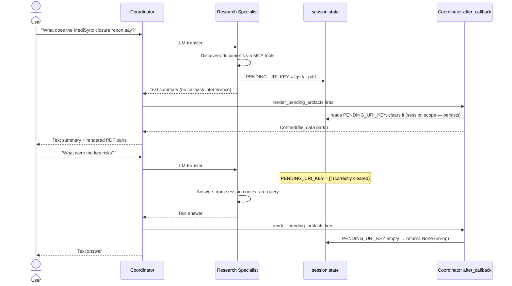

# 13 - Artifact Rendering Callback Scope

This document explains why `render_pending_artifacts` must only run as the Coordinator's `after_agent_callback`, what happens when it is accidentally enabled on sub-agents, and which document-reading capabilities remain available inside sub-agents regardless of this setting.

---

## 1. Background: The Stash-and-Render Pattern

As described in [09-Architecture-and-Deduplication.md](09-Architecture-and-Deduplication.md), the Research-Agent uses a two-phase lifecycle to deliver multimodal file content to the Gemini Enterprise UI:

1. **Stash** — during a turn, tools such as `ImportGcsToArtifactTool` append GCS URIs to `session.state["pending_gcs_uri_renders"]` (`PENDING_URI_KEY`). The tool returns only a plain `dict` to keep its schema clean.
2. **Render** — after the agent's turn is complete, the `render_pending_artifacts` `after_agent_callback` reads `PENDING_URI_KEY`, converts each URI into a `types.Part(file_data=...)`, returns a `Content` containing all parts, and clears the key.

This callback is attached via `AgentBuilder.build(enable_artifact_rendering=True)`.

---

## 2. The Problem: Stale State Across Turns

When `enable_artifact_rendering=True` is set on a **sub-agent** (e.g., the Research Specialist), two issues arise together that cause follow-up questions to return no information.

### Issue 1 — State clearing does not persist from sub-agent callback scope

ADK runs each sub-agent in its own `CallbackContext`. When `render_pending_artifacts` executes inside that sub-agent context and writes:

```python
callback_context.state[PENDING_URI_KEY] = []
```

this mutation is part of a transient state delta that belongs to the sub-agent's callback. ADK does **not** reliably commit this delta back to the persistent session state when the callback returns a non-`None` `Content` — the framework intercepts the flow at that point and the state write is dropped.

As a result, `PENDING_URI_KEY` retains its 3 URIs at the session level even after the sub-agent's callback appears to have cleared them.

### Issue 2 — The sub-agent response is replaced by raw `file_data`

When `after_agent_callback` returns a non-`None` `Content`, ADK **replaces** the agent's text response with that `Content`. The Research Specialist's actual answer (the researched text) is discarded; the Coordinator receives only `file_data` parts.

### Combined effect on a follow-up question

```
Turn N   → research_agent calls import_gcs_to_artifact → queues 3 URIs
         → research_agent's after_callback fires → renders, returns Content(file_data×3)
         → PENDING_URI_KEY appears cleared inside sub-agent scope
         → BUT: session-level PENDING_URI_KEY still = [3 URIs]  ← leak

Turn N+1 → sync_ingestion_status fires (no pending jobs)
         → research_agent is delegated to for the follow-up
         → research_agent's after_callback fires immediately with the 3 stale URIs
         → returns Content(file_data×3) — replaces the actual answer
         → no useful text response reaches the user
```

---

## 3. The Fix: Render Only at Root

The Coordinator (`root_agent`) runs at session scope. Its `after_agent_callback` mutations are always committed to persistent session state. Making the Coordinator the sole renderer eliminates both issues:

- `PENDING_URI_KEY` is cleared exactly once, at session scope, after the full turn completes.
- Sub-agents return their actual text responses without interference.
- URIs queued by any sub-agent during the turn are still picked up and rendered by the Coordinator's callback.

### Rule

| Agent | `build(enable_artifact_rendering=...)` |
| :--- | :--- |
| Any sub-agent (Research Specialist, Ingestion Specialist, …) | `False` — always |
| Coordinator (`root_agent`) | `True` (default) — always |

### Implementation

```python
# Sub-agents — never render
research_agent  = AgentBuilder(...).build(enable_artifact_rendering=False)
ingestion_agent = AgentBuilder(...).build(enable_artifact_rendering=False)

# Coordinator — sole renderer
root_agent = AgentBuilder(...).build()  # default True
```

---

## 4. What Sub-Agents Can Still Read

`enable_artifact_rendering=False` removes only the `after_agent_callback`. It has no effect on any tool. Sub-agents retain full document-reading capability through their existing tools:

| Reading path | Mechanism | Affected? |
| :--- | :--- | :---: |
| User-uploaded files (via UI) | `load_artifacts` built-in tool — called by the agent during its turn; returns file content as an inline tool response | No |
| GCS object text content | GCS MCP server `read_object` tool — returns object bytes/text as a tool response | No |
| GCS PDF / multimodal via `file_data` injection | `import_gcs_to_artifact` tool queues the URI → Coordinator's callback renders it after the full turn | Deferred to Coordinator |

The third path is worth explaining further. Even when `enable_artifact_rendering=True` was set on the Research Specialist, the callback fired **after** the specialist's turn completed — meaning the specialist itself could never read the queued `file_data` within the same turn. The rendered parts appeared in the session for the Coordinator to use. That behavior is identical with `enable_artifact_rendering=False`: the Coordinator's callback renders the queued URIs and the Coordinator's LLM can reference the file content when synthesizing the final response.

---

## 5. Sequence: Correct Two-Turn Flow



---

## 6. Decision Guide: When to Use `enable_artifact_rendering`

| Scenario | Setting |
| :--- | :--- |
| Agent is the root / Coordinator that delivers the final response to the user | `True` (default) |
| Agent is a sub-agent under any Coordinator | `False` — always |
| Agent is standalone (no parent) and delivers the final response directly | `True` (default) |

If you introduce a new sub-agent, always pass `enable_artifact_rendering=False` to its `.build()` call regardless of whether it uses `ImportGcsToArtifactTool`. The setting is cheap to apply and prevents the cross-turn state leak from occurring even if the agent's tool usage changes later.
