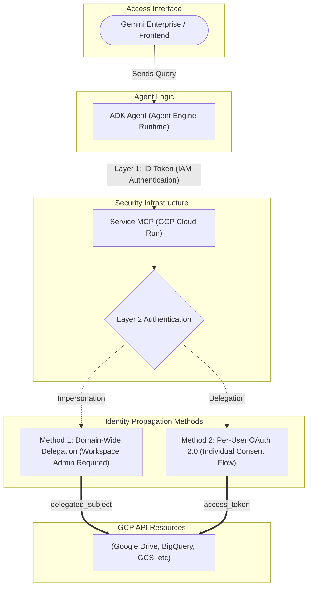
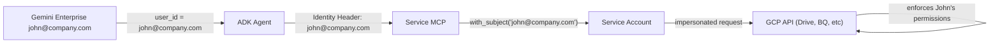
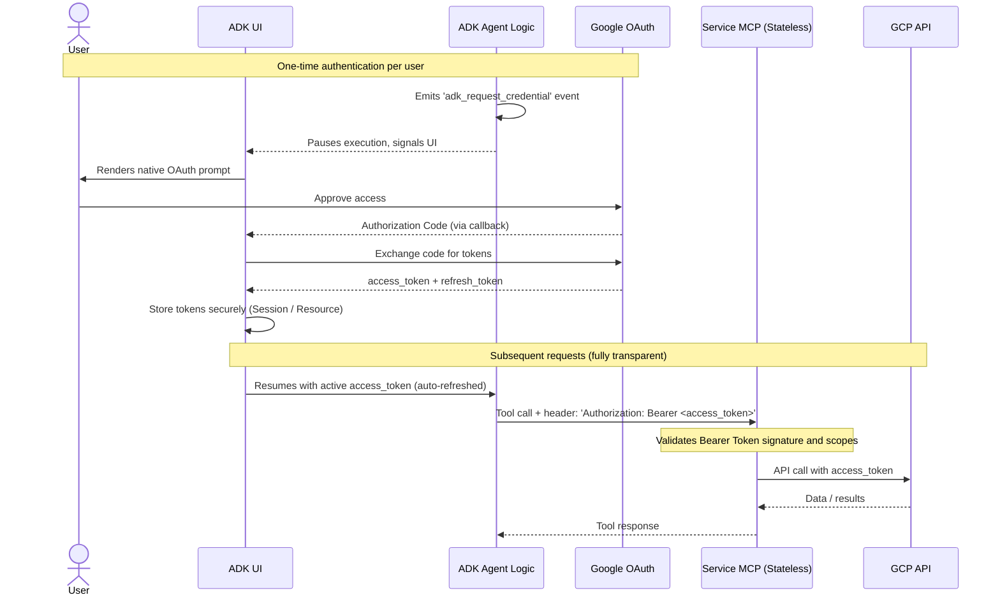
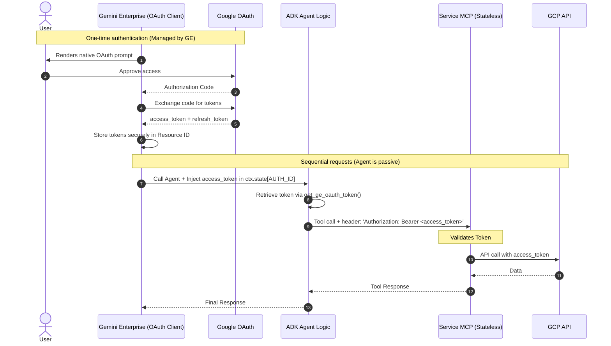

# GCP Services MCP — Authentication Methods

This document describes the available authentication strategies for MCP servers connecting to Google Cloud Services (Drive, BigQuery, GCS, etc.), how they behave inside and outside Gemini Enterprise, and a comparative table to help you choose the right one.

---

## Overview

A typical GCP Service MCP sits between the ADK Agent and the specific GCP API. There are **two separate auth layers**:

| Layer | Purpose | Who handles it |
|---|---|---|
| **Agent → MCP** | Prove the agent is allowed to call the MCP server | Cloud Run IAM (ID token) |
| **MCP → GCP API** | Prove the MCP has permission to access the user's data | One of the two methods below |

This document focuses on the **MCP → GCP API** layer.

---

## Method 1 — Domain-Wide Delegation (DWD)

### How it works

A **Service Account** is granted authority by a Google Workspace Admin to impersonate any user in the organisation. On each tool call, the MCP reads the identity header sent by the agent and builds credentials scoped to that user using `service_account.Credentials.with_subject(user_email)`.

### Setup (one-time, requires Workspace Admin)

1. Create a Service Account in GCP.
2. Download the JSON key and store it in Secret Manager.
3. In [admin.google.com](https://admin.google.com) → Security → API Controls → Domain-wide Delegation:
   - Authorize the SA Client ID with the necessary scopes for the specific GCP service (e.g., Drive, BigQuery).

### Inside Gemini Enterprise

Gemini Enterprise passes the authenticated user's identity in the ADK session. The agent's `header_provider` forwards it to the MCP. No user interaction required.

### Outside Gemini Enterprise (local / direct API)

Set the identity explicitly when creating the session. Works the same way — the SA impersonated whoever is specified.

> [!IMPORTANT]
> Requires a **Google Workspace Super Admin** to configure Domain-Wide Delegation. Not available in personal Gmail accounts.

---

## Method 2 — Per-User OAuth 2.0 (Browser Redirect)

### How it works

The **ADK Agent System (Client)** acts as the OAuth Client. When an MCP Server demands OAuth credentials (e.g. for Google Drive), the ADK framework pauses execution and emits an `adk_request_credential` event.

How this event is handled depends entirely on the client wrapping the agent:
* **In Local Development (ADK UI)**: When running `make run-ui-agent`, the built-in React UI natively intercepts this event. It presents the OAuth consent URL to the developer, exchanges the code, and securely manages the resulting access/refresh tokens in the local browser/server session.
* **In Production (Gemini Enterprise)**: Gemini Enterprise intercepts this event natively. It presents the user with Google's OAuth2 consent screen using its pre-registered Authorization resource (typically involving a redirect to `vertexaisearch.cloud.google.com/static/oauth/oauth.html`). Upon authorization, Gemini Enterprise exchanges the code for tokens and manages the token storage and refresh lifecycle completely transparently.

During each tool call to the MCP server, the framework simply attaches the active access token directly to the incoming request headers (e.g. `Authorization: Bearer <access_token>`). 

**The MCP Server is entirely stateless.** It does not store refresh tokens, nor does it host consent screens. It simply acts as a Resource Server, validating the JWT Bearer token on every incoming request.

> [!NOTE]
> For a deep-dive into the technical lifecycle of the token (intercepting the event, token exchange, and MCP injection), see the **[Detailed OAuth Flow Document](oauth_flow.md)**.

### Token Lifetime

| Token | Lifetime |
|---|---|
| Access token | ~1 hour (auto-refreshed transparently) |
| Refresh token | Effectively permanent* |

> *The refresh token only expires if: the user manually revokes access, the OAuth app is in **Testing** mode, or the token goes unused for a long period.

---

## Method 2 inside Gemini Enterprise (Optimized Flow)

When deploying an ADK Agent to **Gemini Enterprise (GE)**, Method 2 (OAuth) evolves into a highly optimized, non-interactive flow for the agent itself.

### The Shift in Responsibility
In a standard ADK flow, the agent detects missing credentials and pauses to emit an `adk_request_credential` event. **Inside Gemini Enterprise, this is bypassed:**

1.  **GE Platform Management**: Gemini Enterprise acts as the primary OAuth Client. It handles the browser redirect, token exchange, and persistent storage of refresh tokens across user sessions.
2.  **Auth ID Linking**: By linking your agent to an **Authorization Resource** (via a stable `AUTH_ID`), GE knows exactly which OAuth credentials to use.
3.  **Token Injection (Context)**: When GE calls your agent, it automatically injects the active user access token into the ADK's `readonly_context.state` (keyed by your `AUTH_ID`).

### Implementation Strategy
To leverage this optimized flow, the agent's code must:
*   **Use `get_ge_oauth_token`**: Retrieve the token directly from the session context using the designated `AUTH_ID`.
*   **Manual Header Injection**: Manually add the token to the `Authorization` bearer header of the target MCP server call.
*   **Bypass Internal Flow**: Ensure that the tool definitions *do not* include interactive `OAuth2Auth` configurations, as these would cause a redundant (and failing) secondary authentication challenge.

For step-by-step setup instructions for this optimized GE flow, see the **[OAuth Flow for Gemini Enterprise Guide](../AI-Agent-Development/06-OAuth-Inside-Gemini-Enterprise.md)**.

### Outside Gemini Enterprise (local dev)

During local development, the **ADK UI** provides a native interface to handle this. It will safely display the authorization prompt directly in the chat interface, exchange the code, and cache the credentials for the developer. 

If running in pure CLI/headless mode, the `adk_request_credential` event will pause execution and print the OAuth URL to stdout, requiring the developer to click it and manually paste back the authorization code.

---

## Comparative Table

| Feature | DWD (Method 1) | Per-User OAuth (Method 2) |
|---|:---:|:---:|
| **Workspace Admin required** | Yes | No |
| **User must authenticate** | No | Once per user |
| **Per-user data isolation** | Full | Full |
| **GCP native ACLs enforced** | Yes | Yes |
| **Token management** | None needed | Managed natively by Gemini Enterprise |
| **MCP Architecture** | Impersonates users | Stateless Token Validator |
| **Works with personal Gmail** | No | Yes |
| **Works in Gemini Enterprise** | Seamless | Initial consent UI handled natively by GE |
| **Local dev friendly** | Needs SA key | CLI prompts for browser auth |
| **Recommended for production** | Best for Org-wide | Best for strictest privacy/mixed |

---

## References

For authoritative implementation details, refer to the official documentation:
* **ADK Agent Credentials Details**: [Authenticating with Tools (Handling the Interactive OAuth/OIDC Flow)](https://google.github.io/adk-docs/tools-custom/authentication/#2-handling-the-interactive-oauthoidc-flow-client-side)
* **Gemini Enterprise Setup**: [Configure authorization details for ADK agents](https://docs.cloud.google.com/gemini/enterprise/docs/register-and-manage-an-adk-agent#configure-authorization-details)
* **Gemini Enterprise Deployment**: [Register an ADK agent with Gemini Enterprise](https://docs.cloud.google.com/gemini/enterprise/docs/register-and-manage-an-adk-agent#register-an-adk-agent)

## Recommendation by Scenario

| Scenario | Recommended Method |
|---|---|
| Google Workspace org + admin access | **Method 1 (DWD)** |
| Google Workspace org, no admin access | **Method 2 (OAuth + Persistence)** |
| Local development & testing | **Method 2 (OAuth, in-memory)** |
| Personal Gmail users | **Method 2 (OAuth)** |
