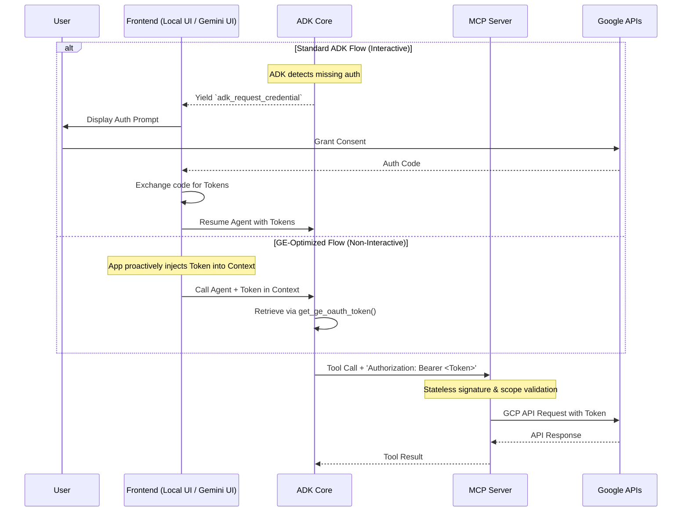

# Detailed OAuth 2.0 Flow & Token Lifecycle

This document provides a technical deep-dive into how the Per-User OAuth 2.0 flow is managed within the AI Agent Architecture. It specifically breaks down the responsibilities at each layer: the ADK Framework, the Frontend Clients (UI Dev Mode & Gemini Enterprise), and the MCP Servers.

## 1. The ADK Layer (The Trigger)

The Agent Development Kit (ADK) sits at the core of the architecture. It orchestrates the LLM, the tools (MCPs), and the session state.

1. **Tool Invocation**: During a user session, the LLM determines it needs to call a secure tool (e.g., the Google Drive MCP).
2. **Missing Token Detection**: The ADK configuration specifies that this tool requires an OAuth 2.0 credential. It attempts to resolve the `AuthCredential` from the current session context.
3. **Event Emission**: If no valid token is present in the session, the ADK immediately pauses the LLM execution. It yields a special system event back to the client application: `adk_request_credential`.
4. **Payload**: This event contains the necessary `auth_config`, including the Client ID, Requested Scopes, and the Authorization URL.

> **Crucial Concept**: The ADK framework *does not* manage the UX, browser redirects, or persistent databases. It simply acts as a circuit breaker, pausing execution and requesting credentials from whatever client is running it.

## 2. The Frontend Layer (Handling Consent & Storage)

How the `adk_request_credential` event is handled depends entirely on the frontend client executing the ADK session.

### A. Local UI Development

When developers test agents locally using the built-in React UI, the ADK UI backend serves as the client.

1. **Interception**: The UI backend intercepts the `adk_request_credential` event via the FastAPI `/run_sse` stream.
2. **Rendering UX**: The React frontend renders a native "Login with Google" prompt directly within the chat interface, using the URL provided in the eventpayload.
3. **Consent & Callback**: The developer clicks the link, authorizes the app in Google, and is redirected to a local callback handler (or manually pastes a code if running strictly headless CLI).
4. **Token Exchange**: The local UI backend exchanges the authorization code for an **Access Token** and a **Refresh Token**.
5. **Storage**: In local dev mode, these tokens are typically held securely in-memory for the duration of the server session or briefly cached in a local temp file strictly bound to the dev environment.
6. **Resumption**: The UI backend resumes the ADK session, injecting the newly acquired tokens into the context.

### B. Production Deployment (Gemini Enterprise - Optimized Flow)

In production, the agent is deployed to **Vertex AI Agent Engine** and integrated with **Gemini Enterprise**. 

> [!WARNING]
> **The ADK's standard interactive OAuth flow (using `auth_credential`) is incompatible with this deployment.** The ADK flow expects a client application to handle browser callbacks and return an exchanged code via a `FunctionResponse`. Agent Engine lacks a web server to receive these callbacks, causing the standard flow to fail or deadlock.

To solve this architectural mismatch, our optimized implementation leverages Gemini Enterprise's native ability to manage user identities proactively and bypasses the ADK's internal auth circuit breaker.

1.  **Platform-Managed Handshake**: Before the agent is even called, Gemini Enterprise handles the entire OAuth handshake (redirect, consent, token exchange). It securely stores the `access_token` and `refresh_token` in a managed **Authorization Resource**.
2.  **Auth ID Mapping**: During deployment, the agent is linked to a specific `AUTH_ID`. This stable identifier allows GE to know exactly which credentials to provide for the session.
3.  **Proactive Context Injection**: Each time GE invokes the agent, it automatically injects the active user's `access_token` into the session context (`ctx.state`), using the `AUTH_ID` as the lookup key.
4.  **Agent-Side Retrieval**: Instead of pausing for framework events, the agent code immediately retrieves the token using the `get_ge_oauth_token` helper.
5.  **Manual Header Injection**: The token is manually attached to the `Authorization` header of the outgoing MCP Tool request.
6.  **Efficiency Gains**: This strategy completely eliminates the "pause-and-resume" cycle in production, resulting in lower latency, reduced complexity in the agent runtime, and a more robust user experience.

**Example Implementation:**
```python
def get_ge_oauth_token(readonly_context: ReadonlyContext, auth_id: str) -> str | None:
    # 1. Retrieve the token from the session state using the stable AUTH_ID
    return readonly_context.state.get(auth_id)

# 2. Configure the MCP Toolset to manually inject the header
mcp_toolset = McpToolset(
    connection_params=StreamableHTTPConnectionParams(url="https://my-mcp-server"),
    header_provider=lambda ctx: {
        "Authorization": f"Bearer {get_ge_oauth_token(ctx, 'my_defined_auth_id')}"
    }
)
```

## 3. The Execution Layer (Using the Token)

Once the client (Local UI or Gemini Enterprise) has provided the valid token back to the ADK session, the execution resumes.

1. **Context Injection**: The `AuthCredential` is injected into the ADK Session context.
2. **Header Attachment**: As the ADK framework constructs the HTTP request to the target MCP Server, the underlying `streamable_http_client` (or equivalent transport) inspects the credential.
3. **Bearer Token Generation**: The `OAuthClientProvider` extracts the active **Access Token** and attaches it to the request as standard headers:
   *  `Authorization: Bearer <access_token>`

## 4. The MCP Layer (Validation)

The MCP Server is the final destination. Its primary responsibility is exposing tools and validating access.

1. **Stateless Nature**: **The MCP Server is entirely stateless regarding authentication.** It does not have a `/auth` endpoint, it does not receive authorization codes to exchange, and it does not connect to a database (like Firestore) to look up user tokens.
2. **Stateless Validation**: When an incoming request arrives, the MCP server extracts the Bearer token from the `Authorization` header.
3. **JWT Verification**: It cryptographically verifies the signature of the access token using Google's public JWKS (JSON Web Key Set), ensuring it hasn't expired and hasn't been tampered with.
4. **Scope Verification**: It verifies that the token contains the specific scopes required to execute the requested tool (e.g., verifying `https://www.googleapis.com/auth/drive.readonly` is present).
5. **API Forwarding**: If valid, the MCP Server uses this exact same access token to authenticate its outward-bound calls to the target Google Cloud/Workspace APIs.

---

### Summary Diagram



## 5. References & Further Reading

For authoritative documentation on these features, please consult the official guides:
* **ADK Agent Credentials Details**: [Authenticating with Tools (Handling the Interactive OAuth Flow)](https://google.github.io/adk-docs/tools-custom/authentication/#2-handling-the-interactive-oauthoidc-flow-client-side)
* **Auth Resources (Gemini Enterprise)**: [Configure authorization details for ADK agents](https://docs.cloud.google.com/gemini/enterprise/docs/register-and-manage-an-adk-agent#configure-authorization-details)
* **Agent Registration (Gemini Enterprise)**: [Register an ADK agent with Gemini Enterprise](https://docs.cloud.google.com/gemini/enterprise/docs/register-and-manage-an-adk-agent#register-an-adk-agent)
